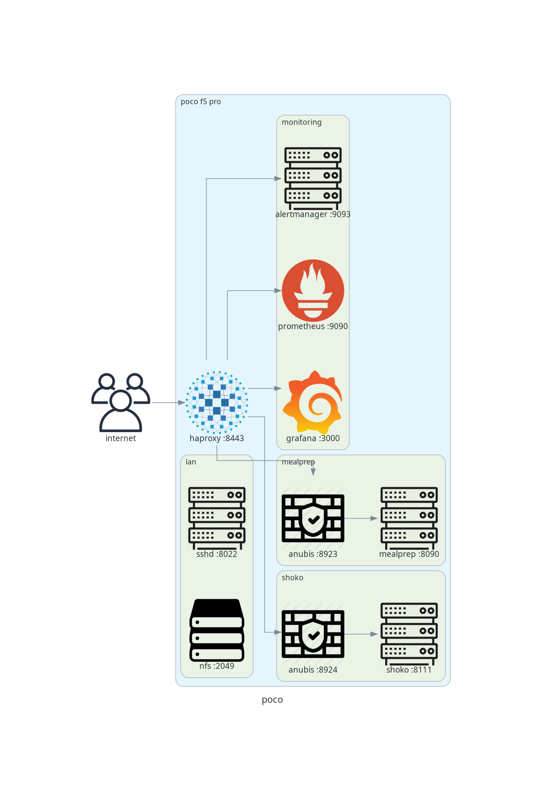

# grafana-dashboards

Dashboards as code. `gen.py` is the source, JSON is build output (gitignored,
generated where Grafana runs). No UI editing; provisioned dashboards are
read-only there anyway.



```sh
./dev                              # watch gen.py + topology.py: every save regenerates png + json, json live in ~10 s
git commit -am "..." && git push   # pushes to github and the phone; post-receive hook checks out + runs gen.py
```

Reload the browser tab after a change; Grafana does not hot-swap an open
dashboard.

Phone setup (once):

```sh
git init --bare ~/git/grafana-dashboards.git
cp deploy/post-receive ~/git/grafana-dashboards.git/hooks/     # from a checkout
# workstation: push to both
git remote set-url --add --push origin https://github.com/sandravwc/grafana-dashboards.git
git remote set-url --add --push origin poco_f5_pro-phone-hyperos:git/grafana-dashboards.git
```

```txt
topology.py  service graph in the diagrams DSL; renders topology.png and feeds the canvas panel
gen.py       panel definitions; reads topology.py for the service graph
dev          save-to-deploy loop
deploy/      post-receive hook for the phone
poco.json    generated (not in git): probes, cert, alerts, service chain, haproxy traffic per backend,
             per-app anubis, cpu/load/memory, battery/thermal, storage, fuse latency
```

Service graph: `topology.py` is plain diagrams code (`python3 topology.py`
renders the png above). Nodes carry extra attributes the png ignores and
`gen.py` uses: `key` (stable id), `addr`, `up` (0/1 PromQL, box colour),
`rpm` (PromQL, number in the box), `at="col,row"` (pin a box). `gen.py` runs
the file with `OUT=dot`, graphviz lays it out, positions snap to a grid,
boxes and arrows become a Canvas panel. Clusters show in the png only.
Declared, not discovered: no tracing, the topology changes when
`~/haproxy.d` does.

Needs graphviz and `pip install diagrams` wherever `gen.py` runs (workstation
`.venv/`, and the phone for the push hook).

Provisioning (see `sandravwc/monitoring`, `deploy/grafana/provisioning/dashboards/`):

```yaml
providers:
  - name: dashboards
    type: file
    options: { path: /data/data/com.termux/files/home/monitoring/dashboards }
```

Datasource uid expected: `prom` (Prometheus). Metrics used come from
node_exporter, blackbox_exporter, haproxy_exporter, anubis, and
`monitoring/deploy/textfile.sh` (`termux_*`).
